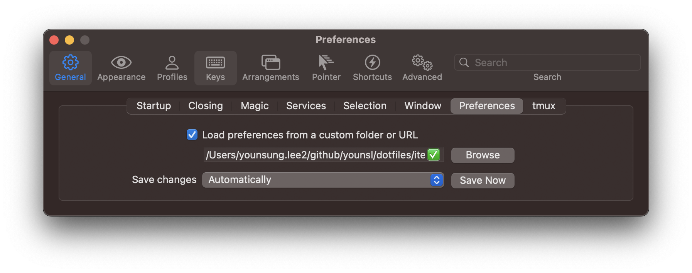

# iterm2

[Sync your iTerm2 Settings and Configs between devices](https://shyr.io/blog/sync-iterm2-configs) 블로그 글을 참고해서 세팅했습니다.



Load preference 기능을 사용하면 여러 대의 맥북 기기에서 동일한 iTerm2 설정값을 사용할 수 있습니다.

&nbsp;

## 사용방법

부트스트랩용 스크립트를 실행하면 Load preference와 iTerm2의 자동 업데이트 기능이 활성화됩니다.

> **주의사항**  
> 최초 세팅시에만 bootstrap 스크립트를 맥 기본 터미널 앱으로 실행해주세요.

```bash
sh bootstrap.sh
```

```bash
[i] Checking for iTerm2 installation...
[i] iTerm2 is already installed.
[i] Disable auto-creation of DS_Store files.
Done.
[i] Setting iTerm preference folder
Done.
[i] Enabling automatic updates
Done.
```

스크립트 실행결과가 위와 같이 나오면 정상적으로 부트스트랩이 완료된 것입니다.

&nbsp;

## 참고자료

[iTerm2 Color Schemes](https://iterm2colorschemes.com/)  
iTerm2 Color Preset 모음
