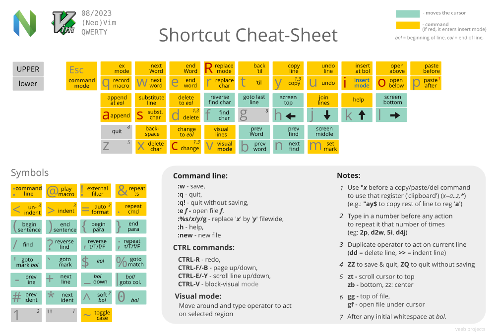

# Neovim Key Mappings

This document provides a comprehensive overview of custom key mappings for Neovim configuration. The leader key is set to Space (`␣`).

## Cheatsheet



```bash
:%d    # [Command Mode] 전체 내용 삭제
ggVGd  # [Normal Mode] 전체 선택 후 삭제
```

## Core Mappings

> Mode: `n` (Normal Mode), `i` (Insert Mode)

### Tab Management
| Key | Mode | Action | Description |
|-----|------|--------|-------------|
| `␣t` | `n` | `:tabnew` | Open new tab |
| `␣]` | `n` | `:tabnext` | Next tab |
| `␣[` | `n` | `:tabprevious` | Previous tab |
| `␣x` | `n` | `:tabclose` | Close current tab |

### Window Operations
| Key | Mode | Action | Description |
|-----|------|--------|-------------|
| `␣v` | `n` | `:vsplit` | Vertical split |
| `␣h` | `n` | `:split` | Horizontal split |
| `␣q` | `n` | `:close` | Close window |
| `Ctrl-h` | `n` | `<C-w>h` | Move to left window |
| `Ctrl-j` | `n` | `<C-w>j` | Move to bottom window |
| `Ctrl-k` | `n` | `<C-w>k` | Move to top window |
| `Ctrl-l` | `n` | `<C-w>l` | Move to right window |

### File Operations
| Key | Mode | Action | Description |
|-----|------|--------|-------------|
| `␣w` | `n` | `:w` | Save file |
| `␣nh` | `n` | `:nohlsearch` | Clear search highlights |

## Plugin Mappings

### Nvim-Tree
| Key | Mode | Action | Description |
|-----|------|--------|-------------|
| `␣n` | `n` | `:NvimTreeToggle` | Toggle file explorer |
| `␣c` | `n` | `:NvimTreeCollapse` | Collapse all folders |
| `␣g` | `n` | Custom function | Focus ~/github/ directory |

### Telescope
| Key | Mode | Action | Description |
|-----|------|--------|-------------|
| `␣ff` | `n` | `find_files` | Search files |
| `␣fg` | `n` | `live_grep` | Search text in files |
| `␣fb` | `n` | `buffers` | List open buffers |
| `␣fh` | `n` | `help_tags` | Search help docs |

### Github Copilot
| Key | Mode | Action | Description |
|-----|------|--------|-------------|
| `Ctrl-l` | `i` | `copilot#Accept` | Accept suggestion |
| `Ctrl-[` | `i` | `copilot#Previous` | Previous suggestion |
| `Ctrl-]` | `i` | `copilot#Next` | Next suggestion |

### Git Fugitive (vim-fugitive)
| Key | Mode | Action | Description |
|-----|------|--------|-------------|
| `␣gs` | `n` | `:Git` | Git status |
| `␣gd` | `n` | `:Git diff` | Git diff all changes |
| `␣gdf` | `n` | `:Gdiff` | Git diff current file |
| `␣ga` | `n` | `:Git add .` | Git add all files |
| `␣gc` | `n` | `:Git commit` | Git commit |
| `␣gcb` | `n` | `:Git checkout -b` | Git create new branch |
| `␣gac` | `n` | Custom function | Git add all and commit |
| `␣gp` | `n` | `:Git push` | Git push |
| `␣gl` | `n` | `:Git log` | Git log |
| `␣gb` | `n` | `:Git blame` | Git blame |
| `␣gq` | `n` | `:Git close` | Close all git windows |

### Gitsigns

**Hunk**: A continuous block of changed lines in a file. Git groups related line changes together as a single "hunk" - this could be added lines (+), deleted lines (-), or modified lines (~). Each hunk represents a logical unit of change that can be staged or reset independently.

| Key | Mode | Action | Description |
|-----|------|--------|-------------|
| `]h` | `n` | `next_hunk` | Jump to next git hunk (next block of changes) |
| `[h` | `n` | `prev_hunk` | Jump to previous git hunk (previous block of changes) |
| `␣hs` | `n` | `stage_hunk` | Stage current hunk (add to git index) |
| `␣hr` | `n` | `reset_hunk` | Reset current hunk (discard changes) |
| `␣hs` | `v` | `stage_hunk` | Stage selected hunk (add to git index) |
| `␣hr` | `v` | `reset_hunk` | Reset selected hunk (discard changes) |
| `␣hS` | `n` | `stage_buffer` | Stage entire buffer (add all file changes) |
| `␣hu` | `n` | `undo_stage_hunk` | Undo stage hunk (remove from git index) |
| `␣hR` | `n` | `reset_buffer` | Reset entire buffer (discard all changes) |
| `␣hp` | `n` | `preview_hunk` | Preview hunk changes (show diff popup) |
| `␣hb` | `n` | `blame_line` | Show git blame for line (who changed it) |
| `␣hd` | `n` | `diffthis` | Diff current file (compare with HEAD) |
| `␣hD` | `n` | `diffthis('~')` | Diff against index (compare with staged) |
| `␣tb` | `n` | `toggle_current_line_blame` | Toggle line blame display |
| `␣td` | `n` | `toggle_deleted` | Toggle deleted lines visibility |
| `ih` | `o`,`x` | `select_hunk` | Select hunk text object (for operations) |

### Treesitter Context (nvim-treesitter-context)
| Key | Mode | Action | Description |
|-----|------|--------|-------------|
| `[c` | `n` | Jump to context | Jump to the context line |

### vim-sandwich

**Add surroundings:** mapped to the key sequence `sa` (add)
```
{surrounded text} → {surrounding}{surrounded text}{surrounding}
```

**Delete surroundings:** mapped to the key sequence `sd` (delete)
```
{surrounding}{surrounded text}{surrounding} → {surrounded text}
```

**Replace surroundings:** mapped to the key sequence `sr` (replace)
```
{surrounding}{surrounded text}{surrounding} → {new surrounding}{surrounded text}{new surrounding}
```

| Key | Mode | Action | Description |
|-----|------|--------|-------------|
| `sa{motion/textobject}{addition}` | `n` | Surround **a**dd | Add surroundings (e.g., `saiw"` adds quotes around word) |
| `sd{deletion}` | `n` | Surround **d**elete | Delete surroundings (e.g., `sd"` deletes quotes) |
| `sr{deletion}{addition}` | `n` | Surround **r**eplace | Replace surroundings (e.g., `sr"'` replaces " with ') |
| `ib`/`ab` | `o`,`v` | Text object | Select text inside/around brackets |
| `is`/`as` | `o`,`v` | Text object | Select text inside/around sandwich |
| `.` | `n` | Repeat operation | Repeat last vim-sandwich operation (built-in support) |

**Common Examples:**

| Freq | Command | Example | Description |
|------|---------|---------|-------------|
| ✓ | `saiw"` | `Hello world!` → `"Hello" world!` | Add double quotes around word (`iw` = inner word) |
| ✓ | `saiW"` | `Hello-world!` → `"Hello-world!"` | Add double quotes around WORD (`iW` = inner WORD, includes punctuation) |
|   | `sr"'` | `"Hello world!"` → `'Hello world!'` | Replace double quotes with single quotes |
|   | `sr'<q>` | `'Hello world!'` → `<q>Hello world!</q>` | Replace single quotes with `<q>` tag |
|   | `srt"` | `<q>Hello world!</q>` → `"Hello world!"` | Replace HTML tag with double quotes |
|   | `sd"` | `"Hello world!"` → `Hello world!` | Delete double quotes |
|   | `V` + `S<p>` | `Hello world!` → `<p>Hello world!</p>` | Add `<p>` tag around selected lines |

## Plugin Setup

This configuration uses [Lazy.nvim](https://github.com/folke/lazy.nvim) as the plugin manager. Key plugins include:

- [Comment.nvim](https://github.com/numToStr/Comment.nvim): Code commenting
- [copilot.vim](https://github.com/github/copilot.vim): Github Copilot (AI code completion)
- [data-explorer.nvim](https://github.com/Kyytox/data-explorer.nvim): Data file explorer (CSV, TSV, JSON)
- [gitsigns.nvim](https://github.com/lewis6991/gitsigns.nvim): Git diff indicators in sign column
- [indent-blankline.nvim](https://github.com/lukas-reineke/indent-blankline.nvim): Indentation lines
- [lualine.nvim](https://github.com/nvim-lualine/lualine.nvim): Statusline plugin
- [nvim-autopairs](https://github.com/windwp/nvim-autopairs): Auto brackets
- [nvim-cmp](https://github.com/hrsh7th/nvim-cmp): Completion engine
- [nvim-lspconfig](https://github.com/neovim/nvim-lspconfig): Language server protocol (LSP)
- [nvim-tree](https://github.com/nvim-tree/nvim-tree.lua): File explorer
- [nvim-treesitter](https://github.com/nvim-treesitter/nvim-treesitter): Syntax highlighting
- [nvim-treesitter-context](https://github.com/nvim-treesitter/nvim-treesitter-context): Code context display for better readability
- [telescope](https://github.com/nvim-telescope/telescope.nvim): Fuzzy finder
- [vim-fugitive](https://github.com/tpope/vim-fugitive): Git integration
- [vim-sandwich](https://github.com/machakann/vim-sandwich): Set of operators and textobjects to search/select/edit sandwiched texts.

## Configuration Philosophy

This Neovim configuration follows a **minimalist approach**, prioritizing:
- **Plugin discipline**: Maintain under 15 plugins total, ensuring each serves a clear, essential purpose (see [plugins directory](./lua/plugins/))
- **Functionality over aesthetics**: Focus on essential features that enhance productivity
- **Performance**: Lightweight setup with minimal plugins for fast startup times
- **Simplicity**: Clean configuration that's easy to understand and maintain
- **Vim fundamentals**: Emphasis on core Neovim capabilities rather than complex UI enhancements

## Editor Settings

Notable editor settings include:
- Line numbers enabled (relative)
- Tab width: 2 spaces
- Mouse support enabled
- Column markers at 80 chars (100 for Go files)
- Clipboard integration
- Auto-save on focus lost
- Case-insensitive search
- Git branch and change status in statusline (via gitsigns.nvim)
  - Format: `filename.lua [branch]+added ~changed -removed`

For detailed plugin configurations and customization options, refer to the individual plugin files in the `lua/plugins` directory.
