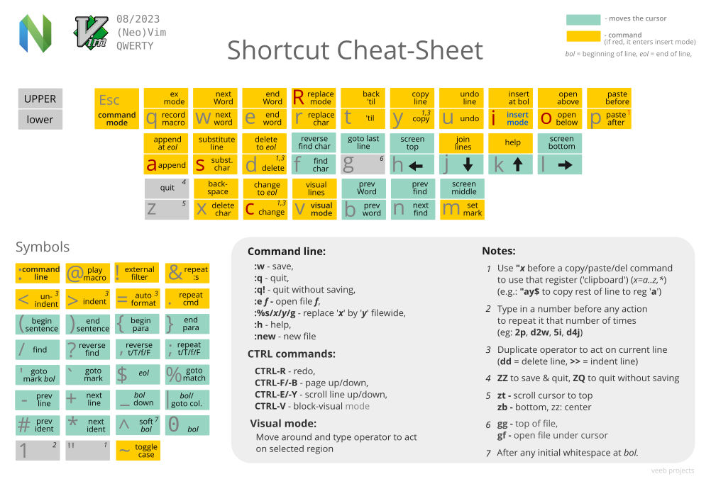

# Neovim Key Mappings

This document provides a comprehensive overview of custom key mappings for Neovim configuration. The leader key is set to Space (`␣`).

## Cheatsheet



```bash
:%d    # [Command Mode] 전체 내용 삭제
ggVGd  # [Normal Mode] 전체 선택 후 삭제
```

## Core Mappings

> Mode: `n` (Normal Mode), `i` (Insert Mode)

### Tab Management
| Key | Mode | Action | Description |
|-----|------|--------|-------------|
| `␣t` | `n` | `:tabnew` | Open new tab |
| `␣]` | `n` | `:tabnext` | Next tab |
| `␣[` | `n` | `:tabprevious` | Previous tab |
| `␣x` | `n` | `:tabclose` | Close current tab |

### Window Operations
| Key | Mode | Action | Description |
|-----|------|--------|-------------|
| `␣v` | `n` | `:vsplit` | Vertical split |
| `␣h` | `n` | `:split` | Horizontal split |
| `␣q` | `n` | `:close` | Close window |
| `Ctrl-h` | `n` | `<C-w>h` | Move to left window |
| `Ctrl-j` | `n` | `<C-w>j` | Move to bottom window |
| `Ctrl-k` | `n` | `<C-w>k` | Move to top window |
| `Ctrl-l` | `n` | `<C-w>l` | Move to right window |

### File Operations
| Key | Mode | Action | Description |
|-----|------|--------|-------------|
| `␣w` | `n` | `:w` | Save file |
| `␣nh` | `n` | `:nohlsearch` | Clear search highlights |

## Plugin Mappings

### Nvim-Tree
| Key | Mode | Action | Description |
|-----|------|--------|-------------|
| `␣n` | `n` | `:NvimTreeToggle` | Toggle file explorer |
| `␣c` | `n` | `:NvimTreeCollapse` | Collapse all folders |
| `␣g` | `n` | Custom function | Focus ~/github/ directory |

### Telescope
| Key | Mode | Action | Description |
|-----|------|--------|-------------|
| `␣ff` | `n` | `find_files` | Search files |
| `␣fg` | `n` | `live_grep` | Search text in files |
| `␣fb` | `n` | `buffers` | List open buffers |
| `␣fh` | `n` | `help_tags` | Search help docs |

### Github Copilot
| Key | Mode | Action | Description |
|-----|------|--------|-------------|
| `Ctrl-l` | `i` | `copilot#Accept` | Accept suggestion |
| `Ctrl-[` | `i` | `copilot#Previous` | Previous suggestion |
| `Ctrl-]` | `i` | `copilot#Next` | Next suggestion |

### Git Fugitive
| Key | Mode | Action | Description |
|-----|------|--------|-------------|
| `␣gs` | `n` | `:Git` | Git status |
| `␣gd` | `n` | `:Git diff` | Git diff all changes |
| `␣gdf` | `n` | `:Gdiff` | Git diff current file |
| `␣ga` | `n` | `:Git add .` | Git add all files |
| `␣gc` | `n` | `:Git commit` | Git commit |
| `␣gac` | `n` | Custom function | Git add all and commit |
| `␣gp` | `n` | `:Git push` | Git push |
| `␣gl` | `n` | `:Git log` | Git log |
| `␣gb` | `n` | `:Git blame` | Git blame |
| `␣gq` | `n` | `:Git close` | Close all git windows |

## Plugin Setup

This configuration uses [Lazy.nvim](https://github.com/folke/lazy.nvim) as the plugin manager. Key plugins include:

- [Comment.nvim](https://github.com/numToStr/Comment.nvim): Code commenting
- [copilot.vim](https://github.com/github/copilot.vim): Github Copilot (AI code completion)
- [indent-blankline.nvim](https://github.com/lukas-reineke/indent-blankline.nvim): Indentation lines
- [nvim-autopairs](https://github.com/windwp/nvim-autopairs): Auto brackets
- [nvim-cmp](https://github.com/hrsh7th/nvim-cmp): Completion engine
- [nvim-lspconfig](https://github.com/neovim/nvim-lspconfig): Language server protocol (LSP)
- [nvim-tree](https://github.com/nvim-tree/nvim-tree.lua): File explorer
- [nvim-treesitter](https://github.com/nvim-treesitter/nvim-treesitter): Syntax highlighting
- [telescope](https://github.com/nvim-telescope/telescope.nvim): Fuzzy finder
- [vim-fugitive](https://github.com/tpope/vim-fugitive): Git integration

## Editor Settings

Notable editor settings include:
- Line numbers enabled (relative)
- Tab width: 2 spaces
- Mouse support enabled
- Column markers at 80 chars (100 for Go files)
- Clipboard integration
- Auto-save on focus lost
- Case-insensitive search

For detailed plugin configurations and customization options, refer to the individual plugin files in the `lua/plugins` directory.
